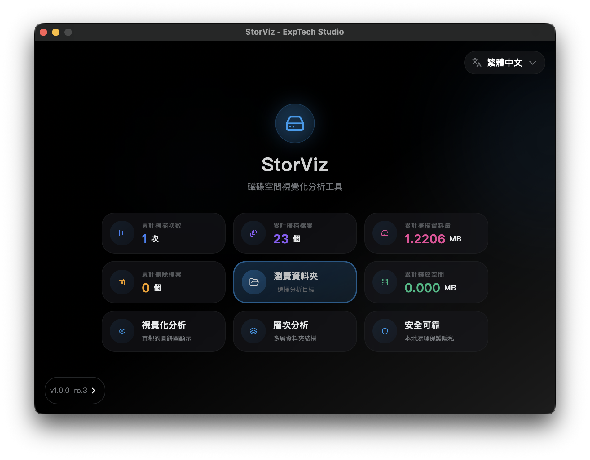
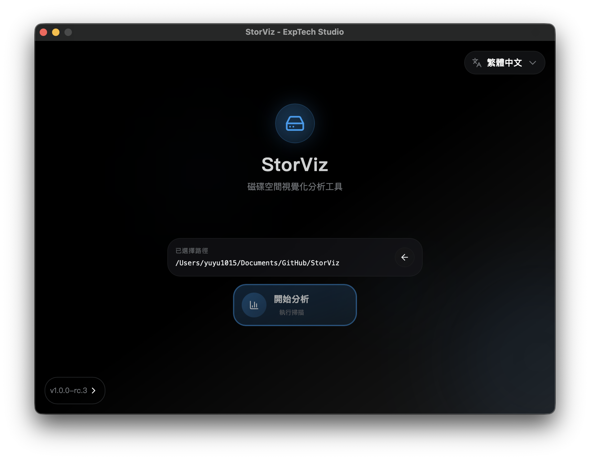
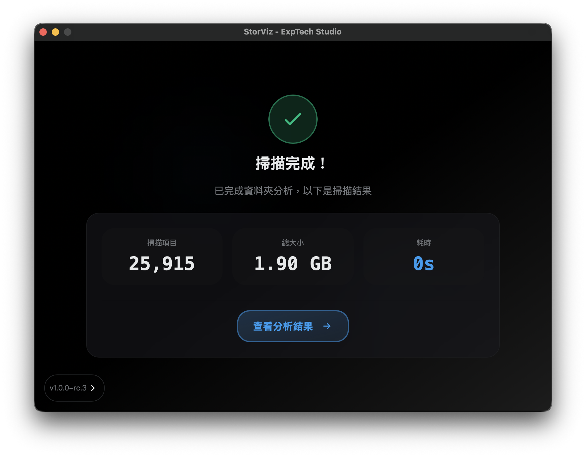
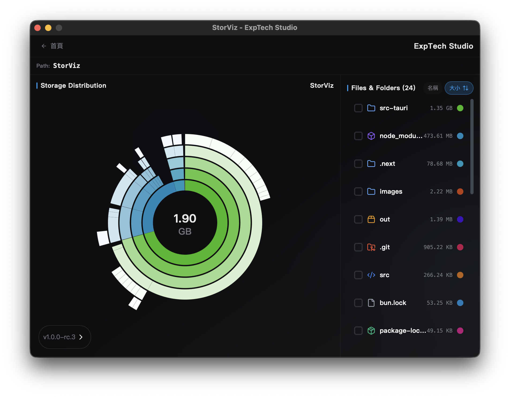
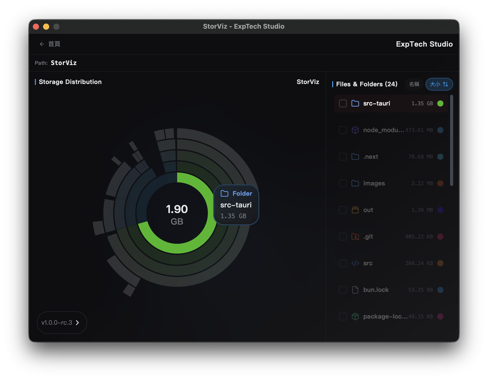
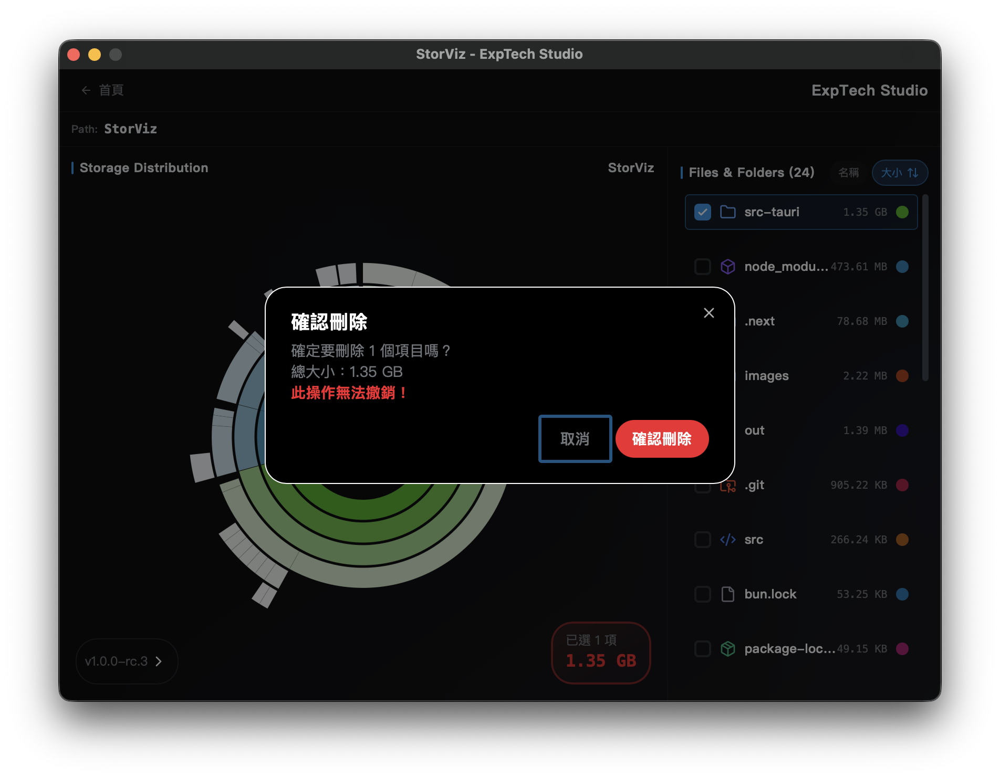

# StorViz

[](https://opensource.org/licenses/AGPL-3.0)
[](https://github.com/ExpTechTW/StorViz/releases)
[](https://github.com/ExpTechTW/StorViz/releases)
[](https://github.com/ExpTechTW/StorViz/actions)
[](https://github.com/ExpTechTW/StorViz)

<p align="center">
  <strong>A modern storage space visualization and analysis tool</strong>
</p>

<p align="center">
  <a href="README.md">繁體中文</a> | <a href="README.en.md">English</a> | <a href="README.ja.md">日本語</a>
</p>

---

StorViz is a powerful disk space analysis tool that helps you quickly understand your storage usage. With an intuitive visual interface, easily identify files and folders taking up space to optimize your storage management.

## 📥 Download & Installation

### Quick Download

<div align="center">

[](https://github.com/ExpTechTW/StorViz/releases/latest/download/StorViz_universal.app.tar.gz)
[](https://github.com/ExpTechTW/StorViz/releases/latest/download/StorViz_1.0.0-rc.3_x64-setup.exe)
[](https://github.com/ExpTechTW/StorViz/releases/latest/download/storviz_1.0.0-rc.3_amd64.AppImage)

</div>

### Installation Steps

<table>
<tr>
<td width="33%" align="center">

### 🍎 macOS

</td>
<td width="33%" align="center">

### 🪟 Windows

</td>
<td width="33%" align="center">

### 🐧 Linux

</td>
</tr>
<tr>
<td width="33%" valign="top">

**Installation Steps:**

1. **Download File**: Click the button above to download the `.app.tar.gz` file
2. **Extract**: Double-click the downloaded file, macOS will auto-extract it
3. **Install**: Drag `StorViz.app` to the Applications folder
4. **Launch**: Double-click the StorViz icon in Applications to start the app

> **💡 Tip**: If you see a "Cannot verify developer" warning, go to "System Preferences" → "Security & Privacy" to allow execution.

</td>
<td width="33%" valign="top">

**Installation Steps:**

1. **Download File**: Click the button above to download the `.exe` installer
2. **Run Installer**: Double-click the downloaded installer
3. **Installation Wizard**: Follow the installation wizard instructions
4. **Launch**: Start StorViz from the Start menu or desktop shortcut

> **💡 Tip**: If Windows Defender shows a warning, select "More info" → "Run anyway".

</td>
<td width="33%" valign="top">

**Installation Steps:**

1. **Download File**: Click the button above to download the `.AppImage` file
2. **Set Permission**: Open terminal and run:
   ```bash
   chmod +x storviz_*.AppImage
   ```
3. **Run**: Double-click to run or execute in terminal:
   ```bash
   ./storviz_*.AppImage
   ```

> **💡 Tip**: AppImage is a portable application that runs without installation.

</td>
</tr>
</table>

## 📋 Supported Operating System Versions

<details>
<summary><h3>🍎 macOS</h3></summary>

| Operating System Version     | StorViz Version | Status |
| ---------------------------- | --------------- | ------ |
| **10.12 Sierra (and below)** | `1.0.0-rc.3`    | ❌     |
| **10.13 High Sierra**        | `1.0.0-rc.3`    | ❔     |
| **10.14 Mojave**             | `1.0.0-rc.3`    | ❔     |
| **10.15 Catalina**           | `1.0.0-rc.3`    | ❔     |
| **11 Big Sur**               | `1.0.0-rc.3`    | ❔     |
| **12 Monterey**              | `1.0.0-rc.3`    | ❔     |
| **13 Ventura**               | `1.0.0-rc.3`    | ❔     |
| **14 Sonoma**                | `1.0.0-rc.3`    | ❔     |
| **15 Sequoia**               | `1.0.0-rc.3`    | ❔     |
| **26 Tahoe**                 | `1.0.0-rc.3`    | ✅     |

**Architecture Support:** Intel (x86_64) / Apple Silicon (ARM64)

</details>

<details>
<summary><h3>🪟 Windows</h3></summary>

| Operating System Version | StorViz Version | Status |
| ------------------------ | --------------- | ------ |
| **XP**                   | `1.0.0-rc.3`    | ❌     |
| **Vista**                | `1.0.0-rc.3`    | ❌     |
| **7**                    | `1.0.0-rc.3`    | ❔     |
| **7 SP1**                | `1.0.0-rc.3`    | ❔     |
| **8**                    | `1.0.0-rc.3`    | ❔     |
| **8.1**                  | `1.0.0-rc.3`    | ❔     |
| **10**                   | `1.0.0-rc.3`    | ✅     |
| **11**                   | `1.0.0-rc.3`    | ✅     |

**Architecture Support:** x64 (64-bit)
**Additional Requirements:** WebView2 Runtime (automatically installed by the installer)

</details>

<details>
<summary><h3>🐧 Linux</h3></summary>

#### Ubuntu

| Operating System Version | StorViz Version | Status |
| ------------------------ | --------------- | ------ |
| **18.04 LTS Bionic**     | `1.0.0-rc.3`    | ❌     |
| **20.04 LTS Focal**      | `1.0.0-rc.3`    | ❌     |
| **22.04 LTS Jammy**      | `1.0.0-rc.3`    | ✅     |
| **23.10 Mantic**         | `1.0.0-rc.3`    | ✅     |
| **24.04 LTS Noble**      | `1.0.0-rc.3`    | ✅     |
| **24.10 Oracular**       | `1.0.0-rc.3`    | ✅     |

#### Debian

| Operating System Version | StorViz Version | Status |
| ------------------------ | --------------- | ------ |
| **10 Buster**            | `1.0.0-rc.3`    | ❌     |
| **11 Bullseye**          | `1.0.0-rc.3`    | ❌     |
| **12 Bookworm**          | `1.0.0-rc.3`    | ✅     |
| **13 Trixie**            | `1.0.0-rc.3`    | ✅     |

#### Fedora

| Operating System Version | StorViz Version | Status |
| ------------------------ | --------------- | ------ |
| **34**                   | `1.0.0-rc.3`    | ❌     |
| **35**                   | `1.0.0-rc.3`    | ❌     |
| **36**                   | `1.0.0-rc.3`    | ❔     |
| **37**                   | `1.0.0-rc.3`    | ❔     |

#### Red Hat Enterprise Linux (RHEL) / Rocky Linux / AlmaLinux

| Operating System Version | StorViz Version | Status |
| ------------------------ | --------------- | ------ |
| **7**                    | `1.0.0-rc.3`    | ❌     |
| **8**                    | `1.0.0-rc.3`    | ❌     |
| **9**                    | `1.0.0-rc.3`    | ❔     |

#### Arch Linux

| Operating System Version | StorViz Version | Status |
| ------------------------ | --------------- | ------ |
| **Rolling Release**      | `1.0.0-rc.3`    | ❌     |

**Architecture Support:** x64 (64-bit)
**Additional Requirements:** GLib >= 2.70, WebKitGTK 4.1

> **⚠️ Note**: Linux version requires newer system libraries (GLIBC 2.35+). Users on Ubuntu 20.04 and Debian 11 are recommended to upgrade to newer versions.

</details>

## ✨ Features

- 📊 **Visual Storage Analysis**: Intuitive visualization of disk space usage with interactive charts
- ⚡ **Fast Scanning**: High-performance directory scanning using Rust backend with parallel processing
- 📁 **File Type Statistics**: Detailed breakdown of storage by file types and extensions
- 🌍 **Multi-language Support**: Available in English, Traditional Chinese, and Japanese
- 🌓 **Dark Mode**: Beautiful dark/light theme support
- 💻 **Cross-platform**: Works on macOS, Windows, and Linux

## 📸 Screenshots

<div align="center">

<table>
  <tr>
    <td width="50%">
      
    </td>
    <td width="50%">
      
    </td>
  </tr>
  <tr>
    <td width="50%">
      
    </td>
    <td width="50%">
      
    </td>
  </tr>
  <tr>
    <td width="50%">
      
    </td>
    <td width="50%">
      
    </td>
  </tr>
</table>

</div>

## 📄 License

This project is open source and available under the [AGPL-3.0](LICENSE) License.

## 🤝 Contributing

Contributions are welcome! If you'd like to contribute to this project, please feel free to submit a Pull Request or open an Issue.

### Contributors

Thanks to all the developers who have contributed to this project!

<a href="https://github.com/exptechtw/StorViz/graphs/contributors">
  
</a>

---

<p align="center">
  If this project helps you, please give us a ⭐️ Star!
</p>
