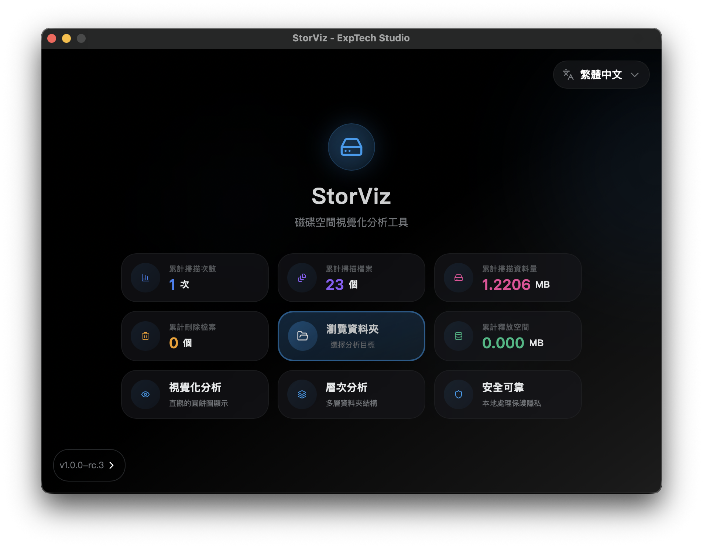
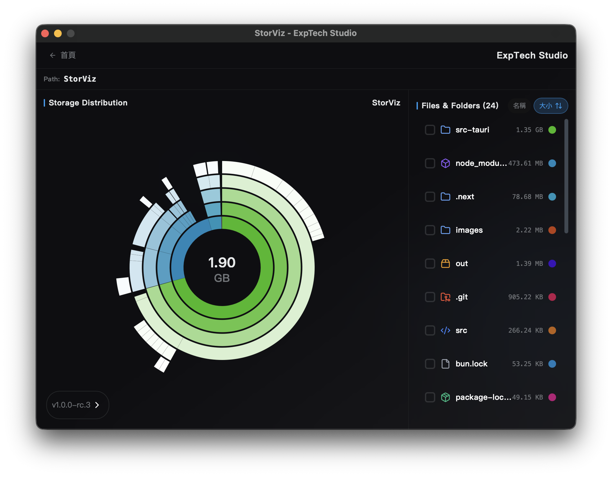

# StorViz

[](https://opensource.org/licenses/AGPL-3.0)
[](https://github.com/ExpTechTW/StorViz/releases)
[](https://github.com/ExpTechTW/StorViz/releases)
[](https://github.com/ExpTechTW/StorViz/actions)
[](https://github.com/ExpTechTW/StorViz)

<p align="center">
  <strong>現代化儲存空間視覺化分析工具</strong>
</p>

<p align="center">
  <a href="README.md">繁體中文</a> | <a href="README.en.md">English</a> | <a href="README.ja.md">日本語</a>
</p>

---

StorViz 是一款功能強大的磁碟空間分析工具，幫助您快速了解儲存空間的使用情況。透過直觀的視覺化介面，輕鬆找出佔用空間的檔案和資料夾，優化您的儲存管理。

## 📥 下載與安裝

### 快速下載

<div align="center">

[](https://github.com/ExpTechTW/StorViz/releases/latest/download/StorViz_universal.app.tar.gz)
[](https://github.com/ExpTechTW/StorViz/releases/latest/download/StorViz_1.0.0-rc.3_x64-setup.exe)
[](https://github.com/ExpTechTW/StorViz/releases/latest/download/storviz_1.0.0-rc.3_amd64.AppImage)

</div>

### 安裝步驟

<details>
<summary>🍎 macOS - 查看安裝步驟</summary>

<br>

1. **下載檔案** - 點擊上方按鈕下載 `.app.tar.gz` 檔案
2. **解壓縮** - 雙擊下載的檔案，macOS 會自動解壓縮
3. **安裝** - 將 `StorViz.app` 拖拽到 Applications 資料夾
4. **啟動** - 在 Applications 中雙擊 StorViz 圖示啟動應用程式

> **💡 提示**
> 如果出現「無法驗證開發者」的警告，請在「系統偏好設定」→「安全性與隱私」中允許執行。

</details>

<details>
<summary>🪟 Windows - 查看安裝步驟</summary>

<br>

1. **下載檔案** - 點擊上方按鈕下載 `.exe` 安裝程式
2. **執行安裝** - 雙擊下載的安裝程式
3. **安裝精靈** - 按照安裝精靈的指示完成安裝
4. **啟動** - 從開始選單或桌面捷徑啟動 StorViz

> **💡 提示**
> 如果 Windows Defender 顯示警告，請選擇「更多資訊」→「仍要執行」。

</details>

<details>
<summary>🐧 Linux - 查看安裝步驟</summary>

<br>

1. **下載檔案** - 點擊上方按鈕下載 `.AppImage` 檔案
2. **設定權限** - 開啟終端機執行：
   ```bash
   chmod +x storviz_*.AppImage
   ```
3. **執行** - 直接雙擊執行或在終端機執行：
   ```bash
   ./storviz_*.AppImage
   ```

> **💡 提示**
> AppImage 是可攜式應用程式，無需安裝即可執行。

</details>

## 📋 支援的作業系統版本

### 🍎 macOS

<details>
<summary>查看支援版本列表</summary>

<br>

| 作業系統版本              | StorViz 版本 | 狀態 |
| ------------------------- | ------------ | ---- |
| **10.15 Catalina 及以下** | `-`          | ❌   |
| **11 Big Sur**            | `-`          | ❔   |
| **12 Monterey**           | `-`          | ❔   |
| **13 Ventura**            | `-`          | ❔   |
| **14 Sonoma**             | `1.0.0-rc.3` | ✅   |
| **15 Sequoia**            | `1.0.0-rc.3` | ✅   |
| **26 Tahoe**              | `1.0.0-rc.3` | ✅   |

**架構支援**：Intel (x86_64) / Apple Silicon (ARM64)

</details>

### 🪟 Windows

<details>
<summary>查看支援版本列表</summary>

<br>

| 作業系統版本 | StorViz 版本 | 狀態 |
| ------------ | ------------ | ---- |
| **8 及以下** | `-`          | ❌   |
| **8.1**      | `1.0.0-rc.3` | ⚠️   |
| **10**       | `1.0.0-rc.3` | ✅   |
| **11**       | `1.0.0-rc.3` | ✅   |

**架構支援**：x64 (64-bit)
**額外需求**：WebView2 執行環境（安裝程式會自動安裝）

> **⚠️ 注意**
>
> Windows 8.1 需要安裝 NET4.8，且深色模式可能異常。

</details>

### 🐧 Linux

<details>
<summary>查看支援版本列表</summary>

<br>

**Ubuntu**

| 作業系統版本               | StorViz 版本 | 狀態 |
| -------------------------- | ------------ | ---- |
| **20.04 LTS Focal 及以下** | `-`          | ❌   |
| **22.04 LTS Jammy**        | `1.0.0-rc.3` | ✅   |
| **23.10 Mantic**           | `1.0.0-rc.3` | ✅   |
| **24.04 LTS Noble**        | `1.0.0-rc.3` | ✅   |
| **24.10 Oracular**         | `1.0.0-rc.3` | ✅   |

**Debian**

| 作業系統版本           | StorViz 版本 | 狀態 |
| ---------------------- | ------------ | ---- |
| **11 Bullseye 及以下** | `-`          | ❌   |
| **12 Bookworm**        | `1.0.0-rc.3` | ✅   |
| **13 Trixie**          | `1.0.0-rc.3` | ✅   |

**Fedora**

| 作業系統版本  | StorViz 版本 | 狀態 |
| ------------- | ------------ | ---- |
| **35 及以下** | `-`          | ❌   |
| **36**        | `-`          | ❔   |
| **37+**       | `-`          | ❔   |

**RHEL / Rocky Linux / AlmaLinux**

| 作業系統版本 | StorViz 版本 | 狀態 |
| ------------ | ------------ | ---- |
| **8 及以下** | `-`          | ❌   |
| **9**        | `-`          | ❔   |

**Arch Linux**

| 作業系統版本 | StorViz 版本 | 狀態 |
| ------------ | ------------ | ---- |
| **滾動發行** | `-`          | ❌   |

**架構支援**：x64 (64-bit)
**額外需求**：GLib >= 2.70, WebKitGTK 4.1

> **⚠️ 注意**
>
> Linux 版本需要較新的系統函式庫支援（GLIBC 2.35+）。
> Ubuntu 20.04 和 Debian 11 用戶建議升級到較新版本。

</details>

## ✨ 功能特色

- 📊 **視覺化儲存分析**：使用互動式圖表直觀地呈現磁碟空間使用情況
- ⚡ **快速掃描**：使用 Rust 後端搭配平行處理技術，提供高效能的目錄掃描
- 📁 **檔案類型統計**：詳細的檔案類型和副檔名儲存空間分析
- 🌍 **多語言支援**：支援英文、繁體中文和日文
- 🌓 **深色模式**：美觀的深色/淺色主題切換
- 💻 **跨平台**：可在 macOS、Windows 和 Linux 上運行

## 📸 螢幕截圖

<div align="center">

<table>
  <tr>
    <td width="50%">
      
    </td>
    <td width="50%">
      
    </td>
  </tr>
  <tr>
    <td width="50%">
      
    </td>
    <td width="50%">
      
    </td>
  </tr>
  <tr>
    <td width="50%">
      
    </td>
    <td width="50%">
      
    </td>
  </tr>
</table>

</div>

## 📄 授權條款

本專案為開源專案，採用 [AGPL-3.0](LICENSE) 授權條款。

## 🤝 貢獻

歡迎貢獻！如果您想為此專案做出貢獻，請隨時提交 Pull Request 或開啟 Issue。

### 貢獻者

感謝所有為此專案做出貢獻的開發者！

<a href="https://github.com/exptechtw/StorViz/graphs/contributors">
  
</a>

---

<p align="center">
  如果這個專案對您有幫助，請給我們一個 ⭐️ Star！
</p>
