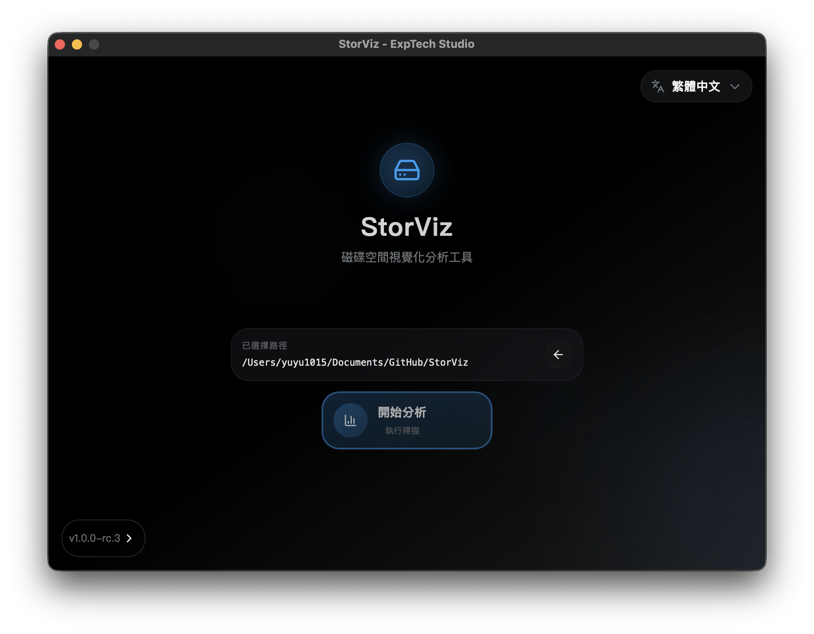

# StorViz

[繁體中文](README.md) | [English](README.en.md) | [日本語](README.ja.md)

現代化儲存空間視覺化分析工具。

## 📥 下載與安裝

### 快速下載

### 安裝步驟

  

    <button onclick="showTab('macos')" id="macos-tab" style="flex: 1; padding: 12px 20px; border: none; background: var(--color-accent-emphasis); color: var(--color-fg-on-emphasis); cursor: pointer; font-size: 16px; font-weight: bold; border-radius: 8px 8px 0 0; margin-right: 5px;">🍎 macOS</button>
    <button onclick="showTab('windows')" id="windows-tab" style="flex: 1; padding: 12px 20px; border: none; background: var(--color-btn-bg); color: var(--color-fg-default); cursor: pointer; font-size: 16px; font-weight: bold; border-radius: 8px 8px 0 0; margin-left: 5px;">🪟 Windows</button>
  

  
  

    <h4 style="margin-top: 0; color: var(--color-fg-default);">macOS 安裝步驟</h4>
    <ol style="line-height: 1.6; color: var(--color-fg-default);">
      <li><strong>下載檔案</strong>：點擊上方「Download for macOS」按鈕下載 <code style="background: var(--color-neutral-muted); color: var(--color-fg-default); padding: 2px 6px; border-radius: 4px;">.app.tar.gz</code> 檔案</li>
      <li><strong>解壓縮</strong>：雙擊下載的檔案，macOS 會自動解壓縮</li>
      <li><strong>安裝</strong>：將 <code style="background: var(--color-neutral-muted); color: var(--color-fg-default); padding: 2px 6px; border-radius: 4px;">StorViz.app</code> 拖拽到 Applications 資料夾</li>
      <li><strong>啟動</strong>：在 Applications 中雙擊 StorViz 圖示啟動應用程式</li>
    </ol>
    

      <strong style="color: var(--color-fg-default);">💡 提示</strong>：如果出現「無法驗證開發者」的警告，請在「系統偏好設定」→「安全性與隱私」中允許執行。
    

    
    <h4 style="margin-top: 20px; color: var(--color-fg-default);">macOS 系統需求</h4>
    <ul style="color: var(--color-fg-default);">
      <li><strong>作業系統</strong>：macOS 10.13 或更高版本</li>
      <li><strong>處理器</strong>：Intel 或 Apple Silicon (M1/M2)</li>
      <li><strong>記憶體</strong>：至少 4GB RAM</li>
      <li><strong>儲存空間</strong>：至少 100MB 可用空間</li>
    </ul>
  

  
  

    <h4 style="margin-top: 0; color: var(--color-fg-default);">Windows 安裝步驟</h4>
    <ol style="line-height: 1.6; color: var(--color-fg-default);">
      <li><strong>下載檔案</strong>：點擊上方「Download for Windows」按鈕下載 <code style="background: var(--color-neutral-muted); color: var(--color-fg-default); padding: 2px 6px; border-radius: 4px;">.exe</code> 安裝程式</li>
      <li><strong>執行安裝</strong>：雙擊下載的安裝程式</li>
      <li><strong>安裝精靈</strong>：按照安裝精靈的指示完成安裝</li>
      <li><strong>啟動</strong>：從開始選單或桌面捷徑啟動 StorViz</li>
    </ol>
    

      <strong style="color: var(--color-fg-default);">💡 提示</strong>：如果 Windows Defender 顯示警告，請選擇「更多資訊」→「仍要執行」。
    

    
    <h4 style="margin-top: 20px; color: var(--color-fg-default);">Windows 系統需求</h4>
    <ul style="color: var(--color-fg-default);">
      <li><strong>作業系統</strong>：Windows 10 或更高版本</li>
      <li><strong>架構</strong>：x64 (64-bit)</li>
      <li><strong>記憶體</strong>：至少 4GB RAM</li>
      <li><strong>儲存空間</strong>：至少 100MB 可用空間</li>
    </ul>
  

## 功能特色

- **視覺化儲存分析**：使用互動式圖表直觀地呈現磁碟空間使用情況
- **快速掃描**：使用 Rust 後端搭配平行處理技術，提供高效能的目錄掃描
- **檔案類型統計**：詳細的檔案類型和副檔名儲存空間分析
- **多語言支援**：支援英文、繁體中文和日文
- **深色模式**：美觀的深色/淺色主題切換
- **跨平台**：可在 macOS 和 Windows 上運行

## 螢幕截圖

## 授權條款

本專案為開源專案，採用 AGPL-3.0 授權條款。

## 貢獻

- 歡迎貢獻！請隨時提交 Pull Request。
  
